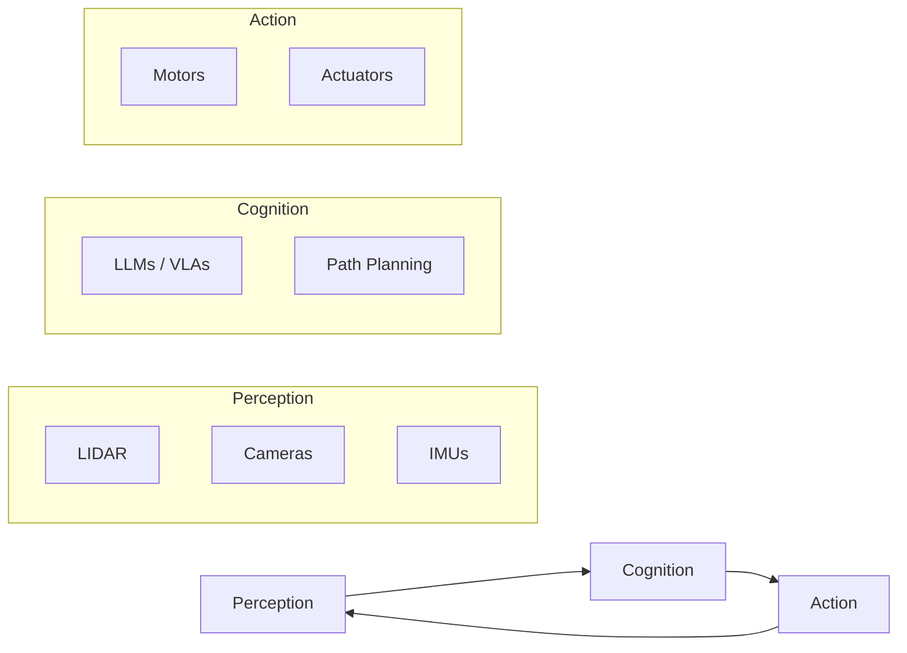

# Foundations of Physical AI

Welcome to the core of Physical AI and Humanoid Robotics. This module explores how machines move from digital reasoning to physical interaction.

:::info Definition
**Physical AI** (or Embodied AI) is the field concerned with creating systems that can perceive, reason about, and interact with the physical world. Unlike pure Digital AI, it must handle real-world constraints like gravity, friction, and safety.
:::

## The Embodied AI Loop

The core architecture of any Physical AI agent follows a continuous loop of perceiving the environment, processing intelligence, and executing actions.

- **Perception:** Converting raw sensor data into environmental understanding.
- **Cognition:** High-level reasoning and decision-making (the "Brain").
- **Action:** Mechanical execution of planned movements.

## Humanoid Robotics Overview

Humanoid robots mimic the human form to operate effectively in human-centric environments, such as stairs and workspaces.

### Degrees of Freedom (DoF)

A standard humanoid robot maps its complexity through active joints:

| Body Part | Degrees of Freedom (DoF) | Description |
| :--- | :--- | :--- |
| **Head** | 2-3 DoF | Pan and Tilt for visual scanning. |
| **Arms** | 7 DoF (x2) | Mimicking shoulder, elbow, and wrist. |
| **Hands** | 5-11 DoF | Dexterous manipulation and grasping. |
| **Legs** | 6 DoF (x2) | Balance and bipedal locomotion. |
| **Total** | **26 - 50+** | Varies by design and complexity. |

## Hardware: Scaling Intelligence

To run Physical AI models, choosing the right hardware for simulation and deployment is critical.

### Hardware Specification Comparison

| Feature | Digital Twin Workstation (Simulation) | Edge Kits (Deployment) |
| :--- | :--- | :--- |
| **Primary Use** | Safe testing, Training, Sim-to-Real | Real-time interference, Mobility |
| **GPU** | NVIDIA RTX 4070 Ti / 4080+ | Jetson Orin Nano / AGX |
| **Memory** | 32GB+ DDR5 | 8GB - 64GB Unified |
| **VRAM** | 12GB+ | Integrated |
| **CPU** | 12th Gen Intel i7 / Ryzen 7000 | ARM Cortex-A78AE |

:::note
Full-scale humanoids typically require the **NVIDIA Jetson Orin AGX** to handle high TOPS (Tera Operations Per Second) for real-time Vision-Language-Action (VLA) models.
:::

## Key Mechanics Glossary

Understanding these fundamental concepts is essential for building and simulating humanoid systems.

- **URDF (Unified Robot Description Format):** An XML-based file format used to describe a robot's geometry, joints, and physical properties.
- **Inverse Kinematics (IK):** The mathematical process of calculating required joint angles to move an end-effector (hand/foot) to a specific target in 3D space.
- **Odometry:** Estimating the change in position over time based on sensor data (wheels or joint encoders).

## The Physical AI Stack

1. **Simulation Layer:** Tools like **NVIDIA Isaac Sim** or Gazebo for safe, high-fidelity testing.
2. **Middleware:** **ROS 2** provides the communication backbone between nodes.
3. **Intelligence Layer:** Foundation Models like GPT-4o or RT-2 delivering high-level reasoning.
