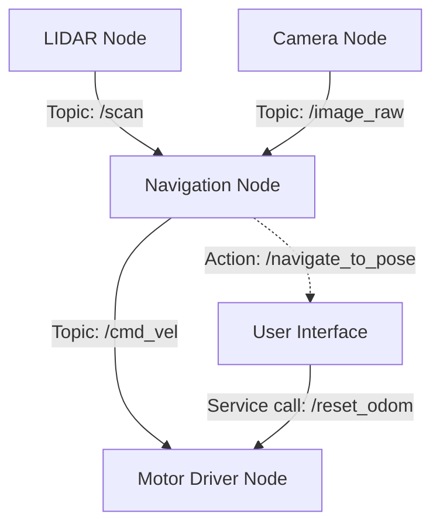

# Module 1: Robotic Nervous System

This module covers the fundamental communication layer of a robot: the **Middleware**. We focus on ROS 2 (Robot Operating System), which acts as the "nervous system," carrying signals from sensors to the brain and commands from the brain to the motors.

## Middleware & ROS 2 Architecture

ROS 2 is a distributed framework that uses **DDS (Data Distribution Service)** for reliable, real-time messaging. Its architecture allows various "nodes" to work independently while staying synchronized.

### Core Concepts:
- **Nodes:** Individual processes that perform computation (e.g., a "Camera Node" or a "Motor Driver Node").
- **Topics:** Asynchronous buses for continuous data flow (e.g., sensor readings).
- **Services:** Synchronous "Request-Response" communication for discrete tasks (e.g., "Take a Photo").
- **Actions:** Long-running tasks with feedback (e.g., "Navigate to Goal").

## Communication Model

The following diagram illustrates how these components interact in a standard robotic setup:

## URDF & Mechanics

The **URDF (Unified Robot Description Format)** is the XML skeleton of the robot. It defines:
1. **Links:** The physical parts (legs, arms, torso).
2. **Joints:** How the links move (fixed, revolute, continuous).
3. **Visual & Collision:** How the robot looks and how it physically interacts with walls/objects.
4. **Inertial:** Mass and center of gravity for physics engines.
