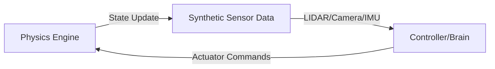

# Module 2: The Digital Twin (Gazebo & Unity)

**Focus:** Physics simulation and environment building.

In this module, we explore the world of high-fidelity robotic simulation. A **Digital Twin** is a virtual representation of a physical robot that allows for safe, cost-effective testing of algorithms before deployment.

## Simulation Platforms: Gazebo vs. Unity

| Feature | Gazebo | Unity / Isaac Sim |
| :--- | :--- | :--- |
| **Primary Use** | Physics validation, collision testing | High-fidelity rendering, HRI, AI training |
| **Physics Engine** | ODE, Bullet, DART | PhysX |
| **Rendering** | Ogre | High Definition Render Pipeline (HDRP) |
| **Strengths** | Accurate mechanical interaction | Photorealistic sensors, complex environments |

## Simulating Physics, Gravity, and Collisions in Gazebo

Gazebo provides realistic physics simulation that is essential for testing robotic algorithms:

- **Physics Engines:** Gazebo supports multiple physics engines (ODE, Bullet, DART) for different simulation needs.
- **Gravity Simulation:** Accurate modeling of gravitational forces for realistic robot movement.
- **Collision Detection:** Advanced collision detection algorithms to handle complex robot-environment interactions.
- **Friction Modeling:** Realistic friction coefficients for different materials and surfaces.

## High-Fidelity Rendering and Human-Robot Interaction in Unity

Unity provides advanced rendering capabilities for creating realistic environments:

- **High-Fidelity Rendering:** Advanced lighting, shadows, and material properties for photorealistic simulation.
- **Human-Robot Interaction (HRI):** Simulating realistic human-robot interactions in complex environments.
- **Environment Creation:** Tools for building complex environments for robot testing and training.
- **Sensor Simulation:** High-quality simulation of various sensors including cameras, LiDAR, and IMUs.

## Simulating Sensors: LiDAR, Depth Cameras, and IMUs

Accurate sensor simulation is crucial for effective robot development:

- **LiDAR Simulation:** Modeling 2D and 3D LiDAR sensors for navigation and mapping.
- **Depth Camera Simulation:** Simulating RGB-D cameras for 3D perception and object recognition.
- **IMU Simulation:** Modeling Inertial Measurement Units for orientation and acceleration data.
- **Sensor Fusion:** Combining data from multiple sensors for enhanced robot perception.

## The Simulation Loop

The interaction between the virtual robot and its environment follows a continuous loop:

## Weekly Breakdown

### Week 6: Gazebo Simulation Environment Setup
- Installing and configuring Gazebo for robotic simulation.
- Setting up the simulation environment with appropriate physics parameters.
- Basic robot spawning and control in Gazebo.

### Week 7: URDF and SDF Robot Description Formats
- Understanding URDF (Unified Robot Description Format) and SDF (Simulation Description Format).
- Converting URDF models for use in Gazebo simulation.
- Adding Gazebo-specific plugins and sensors to robot models.

### Week 8: Physics Simulation and Sensor Simulation
- Configuring physics properties for realistic robot simulation.
- Setting up and calibrating virtual sensors (LiDAR, cameras, IMUs).
- Validating sensor data against real-world expectations.

### Week 9: Introduction to Unity for Robot Visualization
- Setting up Unity for robotic simulation and visualization.
- Creating basic robot models and environments in Unity.
- Integrating Unity with ROS 2 for real-time visualization.

### Week 10: Advanced Unity Simulation Features
- Implementing high-fidelity rendering for photorealistic simulation.
- Creating complex environments for robot testing.
- Human-robot interaction scenarios in Unity.

### Week 11: Sensor Integration and Validation
- Integrating multiple sensor types in both Gazebo and Unity.
- Validating sensor data accuracy and consistency.
- Implementing sensor fusion algorithms in simulation.

### Week 12: Module Review and Assessment
- Comprehensive review of digital twin simulation techniques.
- Final assessment and preparation for Module 3.
