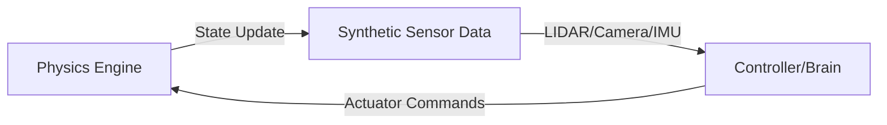

# Module 2: The Digital Twin

In this module, we explore the world of high-fidelity robotic simulation. A **Digital Twin** is a virtual representation of a physical robot that allows for safe, cost-effective testing of algorithms before deployment.

## Simulation Platforms: Gazebo vs. Unity

| Feature | Gazebo | Unity / Isaac Sim |
| :--- | :--- | :--- |
| **Primary Use** | Physics validation, collision testing | High-fidelity rendering, HRI, AI training |
| **Physics Engine** | ODE, Bullet, DART | PhysX |
| **Rendering** | Ogre | High Definition Render Pipeline (HDRP) |
| **Strengths** | Accurate mechanical interaction | Photorealistic sensors, complex environments |

## The Simulation Loop

The interaction between the virtual robot and its environment follows a continuous loop:

## Weekly Breakdown

### Week 4: Gazebo Physics Setup
- Configuring joint properties and friction.
- Validating the robot skeleton (URDF) in a physics environment.

### Week 5: Sensor Fusion
- Integrating virtual sensors ([Hardware Lab Guide](/docs/hardware-lab/index.md)).
- Generating and processing synthetic sensor data for localized mapping.
