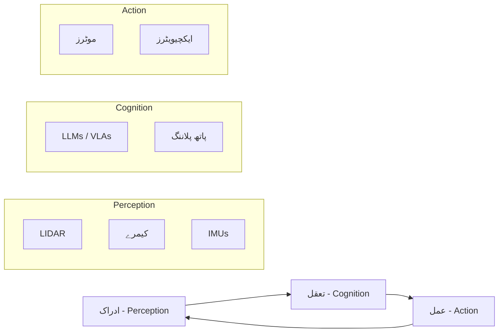

# فزیکل اے آئی کی بنیادیں (Foundations of Physical AI)

فزیکل اے آئی (Physical AI) اور ہیومنائیڈ روبوٹکس (Humanoid Robotics) کے بنیادی سیکشن میں خوش آمدید۔ یہ ماڈیول اس بات کی وضاحت کرتا ہے کہ مشینیں کس طرح ڈیجیٹل سوچ سے فزیکل دنیا کے تعامل (Interaction) تک کا سفر طے کرتی ہیں۔

:::info تعریف
**فزیکل اے آئی** (یا Embodied AI) انجینئرنگ اور سائنس کا وہ شعبہ ہے جس کا مقصد ایسے سسٹمز بنانا ہے جو فزیکل دنیا کو محسوس کر سکیں (Perceive)، اس کے بارے میں سوچ سکیں (Reason)، اور اس کے ساتھ تعامل (Interact) کر سکیں۔ ڈیجیٹل اے آئی کے برعکس، اسے کششِ ثقل (Gravity)، رگڑ (Friction)، اور حقیقی دنیا کی حفاظت جیسی رکاوٹوں کا سامنا کرنا پڑتا ہے۔
:::

## ایمباڈڈ اے آئی لوپ (The Embodied AI Loop)

کسی بھی فزیکل اے آئی ایجنٹ کا بنیادی ڈھانچہ ایک مسلسل لوپ پر مبنی ہوتا ہے جس میں ماحول کو محسوس کرنا، ذہانت کا استعمال کرنا، اور عمل کرنا شامل ہے۔

- **Perception (ادراک):** سینسر کے ڈیٹا کو ماحولیاتی سمجھ میں تبدیل کرنا۔
- **Cognition (تعقل):** اعلیٰ سطح کی سوچ اور فیصلہ سازی (دماغ)۔
- **Action (عمل):** طے شدہ حرکات کا مکینیکل نفاذ۔

## ہیومنائیڈ روبوٹکس کا جائزہ (Humanoid Robotics Overview)

ہیومنائیڈ روبوٹ انسانی شکل کی نقل کرتے ہیں تاکہ وہ انسانوں کے لیے بنائے گئے ماحول (مثلاً سیڑھیاں اور کام کی جگہیں) میں مؤثر طریقے سے کام کر سکیں۔

### ڈگریز آف فریڈم (Degrees of Freedom - DoF)

ایک معیاری ہیومنائیڈ روبوٹ اپنے جوڑوں (Links) کے ذریعے اپنی پیچیدگی کا نقشہ بناتا ہے:

| جسمانی حصہ | ڈگریز آف فریڈم (DoF) | تفصیل |
| :--- | :--- | :--- |
| **سر (Head)** | 2-3 DoF | دیکھنے اور اسکیننگ کے لیے پین اور ٹیلٹ (Pan/Tilt)۔ |
| **بازو (Arms)** | 7 DoF (x2) | کندھے، کہنی اور کلائی کی نقل۔ |
| **ہاتھ (Hands)** | 5-11 DoF | مہارت سے چیزوں کو پکڑنا (Manipulation)۔ |
| **ٹانگیں (Legs)** | 6 DoF (x2) | توازن اور دو پاؤں پر چلنا (Locomotion)۔ |
| **مجموعی طور پر** | **26 - 50+** | ڈیزائن اور پیچیدگی کے لحاظ سے مختلف ہو سکتے ہیں۔ |

## ہارڈ ویئر: ذہانت کو وسعت دینا

فزیکل اے آئی ماڈلز کو چلانے کے لیے، سمولیشن اور نفاذ (Deployment) کے لیے صحیح ہارڈ ویئر کا انتخاب انتہائی ضروری ہے۔

### ہارڈ ویئر کی تفصیلات کا موازنہ

| خصوصیت | ڈیجیٹل ٹوئن ورک اسٹیشن (Simulation) | ایج کٹس - Edge Kits (Deployment) |
| :--- | :--- | :--- |
| **بنیادی استعمال** | محفوظ ٹیسٹنگ، ٹریننگ، سم-ٹو-ریل | ریئل ٹائم نفاذ، نقل و حرکت |
| **GPU** | NVIDIA RTX 4070 Ti / 4080+ | Jetson Orin Nano / AGX |
| **میموری (RAM)** | 32GB+ DDR5 | 8GB - 64GB Unified |
| **VRAM** | 12GB+ | انٹیگریٹڈ (Integrated) |
| **CPU** | 12th Gen Intel i7 / Ryzen 7000 | ARM Cortex-A78AE |

:::note
بڑے پیمانے کے ہیومنائیڈز کو عام طور پر ریئل ٹائم 'ویژن-لینگویج-ایکشن' (VLA) ماڈلز کے لیے **NVIDIA Jetson Orin AGX** کی ضرورت ہوتی ہے تاکہ وہ اعلیٰ TOPS (Tera Operations Per Second) کو سنبھال سکے۔
:::

## بنیادی مکینکس کی فرہنگ (Glossary)

ہیومنائیڈ سسٹمز بنانے اور ان کی سمولیشن کے لیے ان بنیادی تصورات کو سمجھنا ضروری ہے۔

- **URDF (Unified Robot Description Format):** ایک XML فائل فارمیٹ جو روبوٹ کی جیومیٹری، جوڑوں اور فزیکل خصوصیات کو بیان کرنے کے لیے استعمال ہوتا ہے۔
- **Inverse Kinematics (انورس کائنی میٹکس - IK):** ایک مخصوص ہدف تک پہنچنے کے لیے جوڑوں کے مطلوبہ زاویوں کا حساب لگانے کا ریاضیاتی عمل۔
- **Odometry (اوڈو میٹری):** سینسر ڈیٹا کی بنیاد پر وقت کے ساتھ روبوٹ کی پوزیشن میں تبدیلی کا اندازہ لگانا۔

## فزیکل اے آئی اسٹیک (The Physical AI Stack)

1. **سمولیشن لیئر (Simulation Layer):** محفوظ اور اعلیٰ معیار کی ٹیسٹنگ کے لیے **NVIDIA Isaac Sim** یا Gazebo جیسے ٹولز۔
2. **مڈل ویئر (Middleware):** **ROS 2** جو مختلف نوڈز کے درمیان رابطے کا کام کرتا ہے۔
3. **انٹیلیجنس لیئر (Intelligence Layer):** فاؤنڈیشن ماڈلز جیسے GPT-4o یا RT-2 جو اعلیٰ سطح کی سوچ فراہم کرتے ہیں۔
